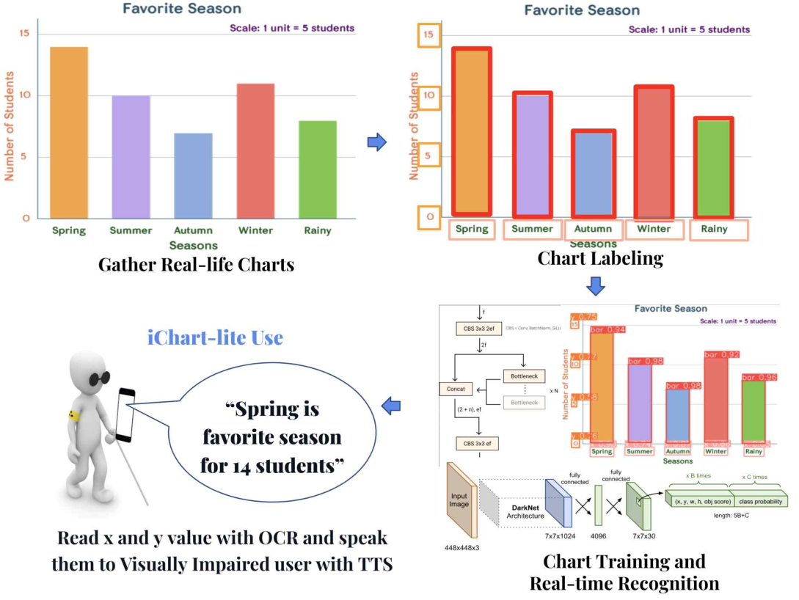
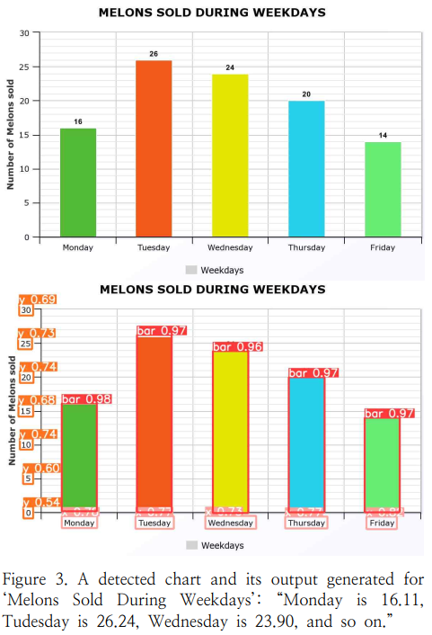

# iChart-lite

<p align="center">
  
</p>

<p align="center">
  Overview of the iChart-lite system for real-time bar-chart understanding and audio description generation.
</p>

Official repository for **iChart-lite: Accessible Charts for the Visually Impaired using Lightweight Extraction Algorithm**.

## Publication

- **Conference:** Korea Software Congress (KSC) 2023
- **Organization:** KIISE
- **Authors:** Gihun Nam, Danu Kim
- **DBpia Article Page:** [iChart-lite on DBpia](https://www.dbpia.co.kr/Journal/articleDetail?nodeId=NODE11705521)
- **Paper PDF:** [Full Paper PDF](papers/iChart.pdf)

## Overview

iChart-lite is a real-time assistive system that helps visually impaired users understand bar charts by automatically extracting chart data and generating textual and auditory descriptions.

The system was designed to address limitations of previous chart-understanding approaches, which often relied on high-cost devices, artificially generated charts, or non-real-time settings. In contrast, iChart-lite focuses on:

- real-world bar chart images
- lightweight inference on portable devices
- real-time usability
- text-to-speech output for accessibility

## Method

The iChart-lite pipeline consists of three major stages:

1. **Object detection**  
   Detect chart components such as bars, X-labels, and Y-labels.

2. **Data extraction**  
   Extract text from labels using OCR and estimate bar values using heuristic rules.

3. **Description generation**  
   Convert extracted chart data into textual descriptions and deliver them through Text-to-Speech (TTS).

The system uses:

- **Ultralytics YOLOv8** for single-step chart component detection
- **Tesseract OCR** for text extraction
- **IQR-based outlier removal**
- **Heuristic post-processing** for missing bars and label alignment
- **Google TTS** for user-facing audio output

## Dataset Availability

This repository can include a small sample subset of chart images and labels for demonstration of the repository structure and annotation format.

For the sample subset:
- `train.txt`, `val.txt`, and `images.json` should match the included sample files exactly.
- matching YOLO label files should be placed under `data/labels/`.

To reproduce the full paper results, prepare the complete dataset and model files in the same directory structure.

## Experimental Setting

- Base model: **YOLO pretrained weights**
- Training platform: **Google Colab**
- GPU: **T4 GPU**
- Epochs: **30**
- Batch size: **16**
- OFFSET parameter: **7**

## Example Result

<p align="center">
  
</p>

<p align="center">
  Example of detected chart components and generated output for a real-world bar chart.
</p>

## Demo Video

- [iChart-lite Demo Video](https://www.youtube.com/watch?v=9E8D6fh1OvI&t=4s)

## Required Files

### Required
- `models/yolov8s.yaml`
- `models/yolov8s-best-82.pt`
- `data/data_82.yaml`
- `data/train.txt`
- `data/val.txt`
- `data/images.json`
- chart images inside `data/images/`
- matching YOLO label files inside `data/labels/`

### Optional
- `models/yolov8s-best-91.pt`
- `data/data_91.yaml`
- presentation slides

## Repository Structure

```text
ichart-lite/
├── README.md
├── iChart.ipynb
├── requirements.txt
├── LICENSE
├── .gitignore
├── assets/
│   ├── ichart_overview.png
│   └── ichart_result.png
├── papers/
│   └── iChart.pdf
├── models/
│   ├── yolov8s.yaml
│   └── yolov8s-best-82.pt
└── data/
    ├── data_82.yaml
    ├── train.txt
    ├── val.txt
    ├── images.json
    ├── images/
    └── labels/
```

## Citation

If you use this code or reference this project, please cite:

Nam, G., & Kim, D. (2023). *iChart-lite: Accessible Charts for the Visually Impaired using Lightweight Extraction Algorithm*. In **2023 Korea Software Congress (KSC)**, 1562-1564.

```bibtex
@inproceedings{nam2023ichartlite,
  author    = {Gihun Nam and Danu Kim},
  title     = {iChart-lite: Accessible Charts for the Visually Impaired using Lightweight Extraction Algorithm},
  booktitle = {2023 Korea Software Congress (KSC)},
  year      = {2023},
  pages     = {1562--1564}
}
```

## Contact

**Danu Kim**  
Korea International School, Jeju Campus  
Email: dukim27@kis.ac
